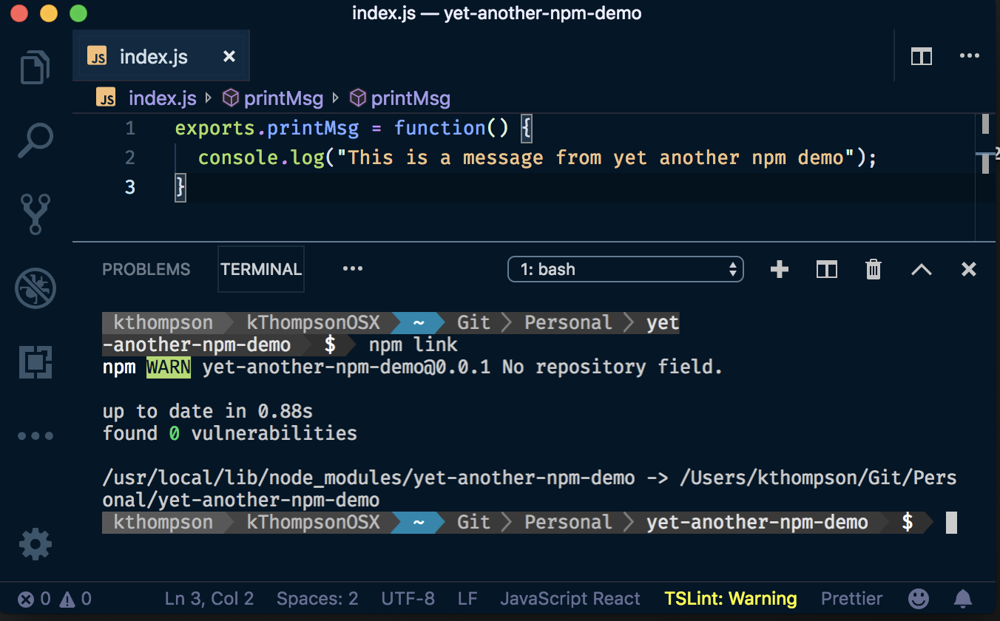
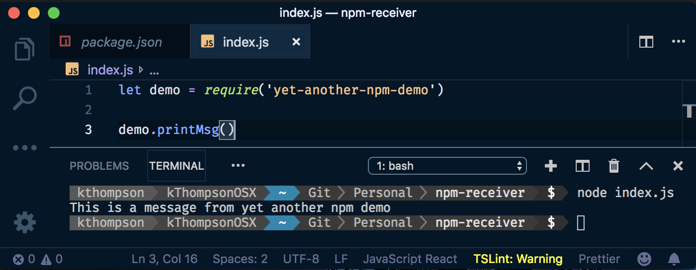
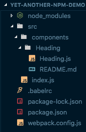
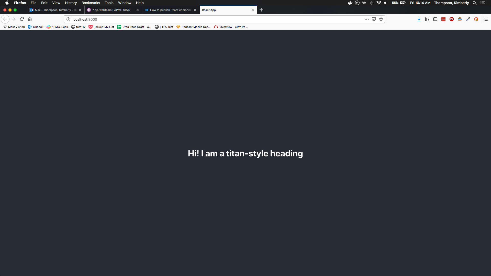

## Creating NPM Packages

</img>
</img>

How to turn your React Components into a library you can download and use via node package manager

Note: For today's tech talk, I decided to speak briefly about how I turned a number of React components we intend to use among multiple websites into NPM packages that we can import and use in any React project.

<--s-->

<!-- .slide: data-background="./assets/saturn-background.png" -->
## Our Libraries

* [apm-titan](https://www.npmjs.com/package/apm-titan)
* [apm-mimas](https://www.npmjs.com/package/apm-mimas)
* apm-saturn (*to be released*)
* slideshow (*to be released?*)

Note: At the moment we have two libraries up and running in beta: `apm-titan` and `apm-mimas`. We intend to call our root site generator **Saturn**, so we decided to name any React component packages after the moons of Saturn. **Titan** is Saturn's largest moon, so naturally it's the name of our biggest package that contains most of the "building blocks" we've been using to build our sites. **Mimas** is a much smaller library used to generate images from our Images API, so it's named after a much smaller moon.

<--s-->

## In a nutshell

1. Create a simple local NPM module
2. Set up the build process with Babel and Webpack
3. Ensure that other React projects can use it with `npm link`
4. Publish to NPM

Note: There are likely many other processes that would work, and there may be some that work even better, but this is the one that worked for me. I'll walk you through the setup, and you're free to follow along if you wish, but it shouldn't be necessary.

<--s-->

## Creating a simple local npm module

Note: Install `npm` and `node` if you haven't already.

<--v-->

Create a new folder called `yet-another-npm-demo`, then create a `package.json` inside it by running `npm init` and following the prompts. Create a file in this folder called `index.js` and copy the following code to it:

```
exports.printMsg = function() {
  console.log("This is a message from yet-another-npm-demo");
}
```

Note: First, we'll be creating a very simple project to demonstrate how to export. Create a folder called **yet-another-npm-demo**, navigate into it and run `npm-init`. The defaults are fine for most options. You're likely going to want to use `MIT` licensing like our other apps, but whatever you set these to is up to you.<br><br>Next, let's give this project a single file: `index.js`, and have it export a single function, `printMsg()`. This can now be used by anyone who downloads `yet-another-npm-demo`.

<--v-->

Run the command `npm link`. This will create an npm package that you can use locally.

</img>

Note: Now, instead of publishing right away, we're going to test that this works as a package using the command `npm link`. If you run it and it builds successfully, you can then use it in other projects on your machine.

<--v-->

In another project that accepts npm packages, run the command `npm link yet-another-npm-demo`. You should now be able to use the `printMsg()` function in another app.

</img>

Note: This is basically equivalent to installing `yet-another-npm-demo` with `npm i yet-another-npm-demo` if this were already published.

<--s-->

## Set up the build process with Babel and Webpack

Note: So far, we haven't done anything that's too useful on its own. In reality, we're going to need use Webpack and Babel to transpile our ES6+ and React code into something that we can then distribute on NPM.

<--v-->

Run the following command to download the dependencies you will need:

```
npm i -D @babel/core @babel/plugin-proposal-class-properties @babel/preset-env @babel/preset-react @babel/runtime babel-loader webpack webpack-cli classnames react
```

Note: `npm i` is a shorthand for `npm install` and `-D` is a shorthand for `--save-dev`

<--v-->

Add the following scripts to the `scripts` section of your `package.json`:

```
"scripts": {
  "build": "webpack --mode production",
  "start": "webpack --mode development"
}
```

And change the target of `"main"` to be `"dist/index.js"`

<--v-->

Then, create a `/src` folder. This is where we'll be creating or placing our React components.

</img>

Note: I added a simple component for this demonstration, so our file structure now looks like this. I'll briefly show you what's in each file.

<--s-->

#### src/components/Heading/Heading.js

```
import React from 'react';
import PropTypes from 'prop-types';
import classNames from 'classnames';

const Heading = (props) => {
  const classes = classNames({
    hdg: true,
    [`hdg-${props.level}`]: props.level,
    [props.elementClass]: props.elementClass
  });
  const Hdg = `h${props.level}`;

  return <Hdg className={classes}>{props.children}</Hdg>;
};

Heading.propTypes = {
  children: PropTypes.node,
  elementClass: PropTypes.string,
  level: PropTypes.number.isRequired
};

export default Heading;
```

Note: This is just the Heading component code from **Titan** with the tests and storybook file stripped out. 

<--v-->

#### src/index.js

```
import Heading from './components/Heading/Heading';
export { Heading };
```

Note: This one imports the Heading component to a central location and exports it from there.

<--v-->

#### webpack.config.js

```
const path = require('path');

module.exports = {
  mode: 'production',
  entry: './src/index.js',
  output: {
    path: path.resolve('dist'),
    filename: 'index.js',
    libraryTarget: 'commonjs2'
  },
  module: {
    rules: [
      {
        test: /\.js?$/,
        exclude: /(node_modules)/,
        use: 'babel-loader'
      }
    ]
  },
  resolve: {
    extensions: ['.js']
  }
};
```

Note: This ensures that we pack everything up into our new `/dist` folder and process it via the Babel Loader.

<--v-->

#### .babelrc

```
{
  "presets": ["@babel/preset-env", "@babel/preset-react"],
  "plugins": ["@babel/plugin-proposal-class-properties"]
}
```

Note: And this of course just tells Babel which settings to use and when.

<--v-->

#### package.json

```
{
  "name": "yet-another-npm-demo",
  "version": "0.0.1",
  "description": "A demonstration for my npm package tech talk",
  "main": "dist/index.js",
  "scripts": {
    "build": "webpack --mode production",
    "start": "webpack --mode development",
    "test": "echo \"Error: no test specified\" && exit 1"
  },
  "author": "Kim Thompson",
  "license": "MIT",
  "devDependencies": {
    "@babel/core": "^7.4.0",
    "@babel/plugin-proposal-class-properties": "^7.4.0",
    "@babel/preset-env": "^7.4.2",
    "@babel/preset-react": "^7.0.0",
    "@babel/runtime": "^7.4.2",
    "babel-loader": "^8.0.5",
    "classnames": "^2.2.6",
    "react": "^16.8.6",
    "webpack": "^4.29.6",
    "webpack-cli": "^3.3.0"
  }
}
```

Note: And, as a quick reminder, this is roughly what your package should look like (minus the author)

<--s-->

Now, if you run `npm build` and rerun `npm link` (because your "main" folder changed), you should be able to use this component in another React project. Run `npm link yet-another-npm-demo` in that directory.

Note: Just to demonstrate that it works, I spun up a quick example project with `create-react-app` and replaced their default App logo with my Heading.

<--v-->

Import it like this:

```
import { Heading } from 'yet-another-npm-demo`;
```

And use it in your `render()` function like this:

```
class App extends Component {
  render() {
    return (
      <div className="App">
        <header className="App-header">
          <Heading level={3}>Hi! I am a titan-style heading</Heading>
        </header>
      </div>
    );
  }
}
```

Note: 

<--v-->

Now, when you run the project with `npm run start`, you'll see this at [localhost:3000](http://localhost:3000).

</img>

Note: And that's it! You're now using an NPM package that you made and importing components from it.

<--s-->

## Publishing to NPM

Go to [npmjs.com](https://www.npmjs.com/) and create an account if you don't already have one. Then enter `npm login` in your terminal and answer the prompts for your **username**, **password** and **email**.

Note: Next, we're going to go over publishing. You'll only have to do this part if you've never published to NPM before.

<--v-->

<!-- .slide: data-background="./assets/fireworks-background.png" -->
## Publish it already

</img>

Run `npm run publish`.

That's it! Try downloading your package with `npm i [your-package-name]` and use it however and wherever you please.

<--v-->

## Other useful commands

* [`npm-access`](https://docs.npmjs.com/cli/access.html): Set the access level on published packages
* [`npm-deprecate`](https://docs.npmjs.com/cli/deprecate): Deprecate version(s) of an application
* [`npm-unpublish`](https://docs.npmjs.com/cli/unpublish): Unpublish version(s) of an application

Note: You should generally avoid unpublishing things, especially if someone may already be relying on that version of a package. Also, you won't be able to re-publish to that particular version number for 24 hours after you run the command anyway. It's often safer and easier to just publish your newer changes and increment the patch number, then mark the previous version deprecated.

<--s-->

## Credits

This tutorial was a mix of the following:

* [NPM's official guide](https://docs.npmjs.com/creating-node-js-modules)
* [How to publish a npm package in four steps](https://medium.com/@vmarchesin/how-to-publish-a-npm-package-in-four-steps-4344ab88e852) by Vinicius Marchesin Araujo
* [How to Create a React app from scratch using Webpack 4](https://medium.freecodecamp.org/part-1-react-app-from-scratch-using-webpack-4-562b1d231e75) by Linh Nguyen My
* [How to make a Beautiful Tiny NPM Package and Publish it](https://medium.freecodecamp.org/how-to-make-a-beautiful-tiny-npm-package-and-publish-it-2881d4307f78) by Jonathan Wood

<--v-->
This presentation was made with [reveal-md](https://github.com/webpro/reveal-md), a library that uses [reveal.js](https://github.com/hakimel/reveal.js/) to create slides and transitions from a markdown file. The color scheme of this file is based on the VSCode theme [Night Owl](https://marketplace.visualstudio.com/items?itemName=sdras.night-owl) by Sarah Drasner

<--v-->

### If you wish to review this presentation in the future, you can find it on my website

[kimthompson.me/tech-talk-npm-package](http://kimthompson.me/tech-talk-npm-package/)